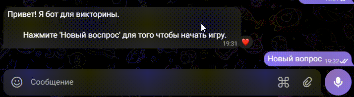

# Quiz-bot
Данный проект представляет собой систему ботов c викториной для пользователей, через Telegram или VK.
Основные возможности:
1. Выдавать пользователю случайный вопрос
2. Сохранять текущий вопрос пользователя (Redis)
3. Проверять ответ и начислять очки
4. Показывать правильный ответ по кнопке "сдаться" и выдавать новый вопрос
5. Показывать счет по кнопке "счет"
6. Бот имеет кнопочную клавиатуру
    - Новый вопрос
    - Сдать вопрос
    - Счёт

### Технологии
- Python 3.11+
- Redis

## Зависимости
Все зависимости указаны в `requirements.txt`. Установите их с помощью команды:
```bash
pip install -r requirements.txt
```
### Переменные окружения
Перед запуском создайте файл `.env` в корне проекта и добавьте туда ваши ключи и токены:
```bash
API_KEY_TG_BOT=токен_вашего_тг_бота
REDIS_HOST=ваш_хост
REDIS_PORT=ваш_порт
REDIS_PASSWORD=токен_вашего_redis
API_KEY_VK_BOT=токен_вашего_вк_бота
```
#### Как получить

| Переменная    | Описание      |
| ------------- | ------------- |
| API_KEY_TG_BOT | токен вашего Telegram бота, чтобы его получить, создайте бота в [@BotFather](https://telegram.me/BotFather).  |
| API_KEY_VK_BOT | токен вашего VK бота, полученный в настройках группы во вкладке "Работа с API" --> "Создать ключ доступа".  |
| REDIS_HOST | адрес сервера Redis (например, localhost или IP-адрес)|
| REDIS_PORT | порт, на котором запущен Redis|
| REDIS_PASSWORD | пароль, если настроена аутентификация в Redis|

## Запуск проекта
1. Склонируйте репозиторий
```bash
git clone http://github.com/pereskokovae/quiz-bot.git
```

2. Создайте и активируйте виртуальное окружение
Для Windows:
```bash
python -m venv venv
```
```bash
venv\Scripts\activate
```
Для Linux/macOS:
```bash
python3 -m venv venv
```
```bash
source venv/bin/activate
```

3. Установите зависимости
```bash
pip install -r requirements.txt
```

4. Запуск ботов
После настройки `.env` вы можете запустить бота для Telegram или VK:
```bash
python tg_bot.py
python vk_bot.py
```


### Парсинг данных в quiz_questions.json.
В скрипте `serializer.py` есть функция, которая отвечает за загрузку сырого текста вопросов из указанной директории.
Она используется перед сериализацией вопросов в удобный JSON-формат.
Что делает :
 • читает все файлы в из заданной папки (по умолчанию: quiz_questions/);
 • парсит содержимое (вопрос / ответ(с пояснением) ), очищает текст;
 • собирает словарь и записывает quiz_questions.json.
#### Как запустить
Есть несколько вариантов запуска.
1.  
- Создайте папку quiz_questions с необработанными данными
- Запустите скрипт командой:
```bash
python serializer.py
```
2. 
- Через .env файл
- Пропишите в .env путь до файла с вопросами:
```bash
QUIZ_PATH=Ваше_имя_папки/
```
- Запустите скрипт командой:
```bash
python serializer.py
```
3. 
- Вызов через команду (CLI)
- Пропишите в терминале
```bash
python serializer.py --path Ваше_имя_папки/
```

### Пример работы бота в Telegram:
